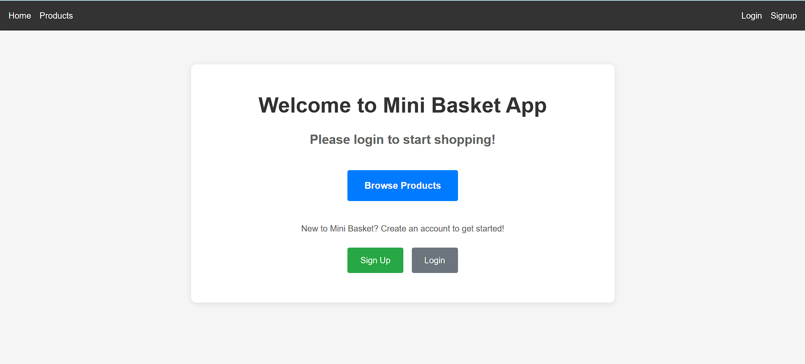

# Mini Basket App - React Router Assessment

A comprehensive e-commerce application built with React, demonstrating modern web development concepts including routing, authentication, state management, and local storage.

## 🚀 Features

### Core Functionality
- **Product Catalog**: Browse 10+ products with detailed information
- **Dynamic Routing**: Product detail pages with URL parameters
- **Shopping Cart**: Add, remove, and modify cart items
- **Order Management**: Track orders with status updates
- **User Authentication**: Signup/Login with local storage
- **Protected Routes**: Dashboard access requires authentication

### Technical Features
- **React Router**: Complete routing with dynamic parameters
- **React Hooks**: useState, useEffect, useParams, useNavigate
- **Local Storage**: Persistent cart and user data
- **Conditional Rendering**: Dynamic UI based on state
- **Component Architecture**: Reusable components with props
- **Responsive Design**: Mobile-friendly interface

## 🛠️ Technologies Used

- **React 18** - Frontend framework
- **React Router DOM** - Client-side routing
- **Vite** - Build tool and development server
- **JavaScript (ES6+)** - Programming language
- **CSS3** - Styling and responsive design
- **Local Storage API** - Data persistence

## 📁 Project Structure

react-router-assessment/
├── public/
│ └── index.html
├── src/
│ ├── assets/ # Product images
│ ├── components/
│ │ ├── Header.jsx # Navigation component
│ │ ├── ProductCard.jsx # Product display component
│ │ └── CartItem.jsx # Cart item component
│ ├── pages/
│ │ ├── Home.jsx # Landing page
│ │ ├── Products.jsx # Product catalog
│ │ ├── ProductDetail.jsx # Individual product page
│ │ ├── Cart.jsx # Shopping cart
│ │ ├── Orders.jsx # Order management
│ │ ├── Signup.jsx # User registration
│ │ ├── Login.jsx # User authentication
│ │ └── Dashboard.jsx # Protected user dashboard
│ ├── data/
│ │ ├── products.js # Product data
│ │ └── orders.js # Sample orders
│ ├── App.jsx # Main app component
│ ├── App.css # Global styles
│ └── main.jsx # App entry point
├── .gitignore
├── package.json
└── README.md

text

## 🚀 Getting Started

### Prerequisites
- Node.js (v14 or higher)
- npm or yarn package manager

### Installation

1. **Clone the repository**
git clone https://github.com/yourusername/react-router-assessment.git
cd react-router-assessment

text

2. **Install dependencies**
npm install

text

3. **Start the development server**
npm run dev

text

4. **Open in browser**
Navigate to `http://localhost:5173`

## 📱 Usage Guide

### Getting Started
1. **Home Page**: Welcome screen with navigation options
2. **Browse Products**: View all available products
3. **Product Details**: Click "View Details" for detailed product information
4. **Add to Cart**: Use "Add to Cart" buttons on product cards or detail pages

### User Authentication
1. **Sign Up**: Create a new account with username, email, and password
2. **Login**: Access your account with email and password
3. **Dashboard**: View personalized dashboard after login

### Shopping Experience
1. **Cart Management**: Add/remove items, adjust quantities
2. **Checkout Process**: Convert cart items to orders
3. **Order Tracking**: View order history with status updates
4. **Order Management**: Update order status, cancel orders, reorder items

## 🎯 Key Learning Objectives Demonstrated

### React Concepts
- ✅ **Components & Props**: Reusable components with data passing
- ✅ **State Management**: useState for local component state
- ✅ **Effect Hooks**: useEffect for side effects and lifecycle
- ✅ **Conditional Rendering**: Dynamic UI based on application state

### React Router
- ✅ **Routing Setup**: BrowserRouter with nested routes
- ✅ **Dynamic Routes**: URL parameters with useParams
- ✅ **Navigation**: Programmatic navigation with useNavigate
- ✅ **Protected Routes**: Authentication-based route access

### Data Management
- ✅ **Local Storage**: Persistent data across browser sessions
- ✅ **State Persistence**: Cart and user data management
- ✅ **CRUD Operations**: Create, read, update, delete functionality

## 🔧 Available Scripts

- `npm run dev` - Start development server
- `npm run build` - Build for production
- `npm run preview` - Preview production build
- `npm run lint` - Run ESLint for code quality

## 🌟 Features Showcase

### Dynamic Product Catalog
- 10 products with images, prices, categories, and descriptions
- Stock management with conditional rendering
- Real-time cart integration

### Advanced Cart Functionality
- Quantity management with +/- controls
- Individual item removal
- Total calculation and cart persistence
- Clear cart functionality

### Order Management System
- Order creation from cart checkout
- Status tracking (Pending → Shipped → Delivered)
- Order filtering and statistics
- Reorder functionality

### Authentication System
- User registration with validation
- Login with credential verification
- Protected dashboard access
- Session management with localStorage

## 🎨 Design Features

- **Responsive Layout**: Works on desktop, tablet, and mobile
- **Modern UI**: Clean, intuitive interface design
- **Visual Feedback**: Hover effects, transitions, and status indicators
- **Accessibility**: Proper semantic HTML and keyboard navigation

## 🚀 Deployment

### Build for Production
npm run build

text

### Deploy Options
- **Vercel**: `vercel --prod`
- **Netlify**: Drag and drop `dist` folder
- **GitHub Pages**: Use `gh-pages` package

## 📈 Future Enhancements

- [ ] Add product search and filtering
- [ ] Implement wishlist functionality
- [ ] Add product reviews and ratings
- [ ] Integrate payment processing
- [ ] Add real backend API integration
- [ ] Implement admin panel for product management

## 📄 License

This project is licensed under the MIT License - see the [LICENSE](LICENSE) file for details.

## 🙏 Acknowledgments

- React.js documentation and community
- React Router documentation
- Vite for fast development experience
- Modern web development best practices

---

⭐ **Star this repository if you found it helpful!**